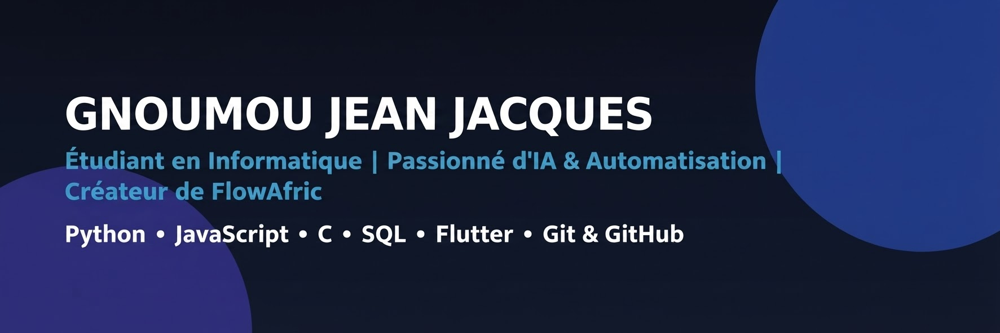

<h1 align="center">Salut 👋, moi c'est GNOUMOU Jean Jacques !</h1>
<h3 align="center">Étudiant en deuxième année d'informatique & passionné d'intelligence artificielle et d'automatisation</h3>

  
  
  
  

  

 
  
Visitor count

  

---

### 🔭 Ce sur quoi je travaille
- 🌍 **FlowAfric** : Une initiative visant à démocratiser et étendre l'accessibilité des outils d'IA sur le continent africain.
- 📱 **aelf-flutter** : Contribution open-source sur GitLab (mise en place d'un système de notifications programmées).

### 💻 Mes compétences & Outils

  
  
  
  
  
  
  
  

### 📊 Mes statistiques GitHub

  
  

### 💬 Discutez avec moi de :
- L’utilisation de IA  et automatisation des flux de travail.
- Développement personnel, actualité Tech, investissement , et création de contenus éducatifs sur l'IA.
- Jesus Christ 

### 📫 Comment me joindre
- 💼 **LinkedIn (Principal) :** [Mon Profil LinkedIn](https://www.linkedin.com/in/gnoumou-jean-jacques-3b9186385)
- 💬 **WhatsApp :** [Discuter sur WhatsApp](https://wa.me/message/LVZWY432Q2EUE1) (ou par téléphone : `54348851`)
- 📧 **Email :** `jeangnoumou55@gmail.com`
- ✖️ **X (Twitter) :** [@jean73127](https://x.com/jean73127?s=11)
- 📸 **Instagram :** [@_jean.jacques_](https://www.instagram.com/_jean.jacques_?stkn=cjRwdzA4d2g4ZWU3&utm_source=qr)
- 📘 **Facebook :** [Profil Facebook](https://www.facebook.com/share/19jVgc7Vyf/?mibextid=wwXIfr)

---

> *"Rendez à chacun ce qui lui est dû : l'impôt à qui vous devez l'impôt, la taxe à qui vous devez la taxe, la crainte à qui vous devez la crainte, l'honneur à qui vous devez l'honneur. Ne devez rien à personne, si ce n'est de vous aimer les uns les autres... Revêtez-vous du Seigneur Jésus-Christ..."* — **Romains 13:7-14**

 

  <i>Merci d'avoir pris le temps de découvrir mon profil. N'hésitez pas à me contacter! à très vite 👋🏽 </i> 🌟

<!--
**Jacques-GN/Jacques-GN** is a ✨ _special_ ✨ repository because its `README.md` (this file) appears on your GitHub profile.

Here are some ideas to get you started:

- 🔭 I’m currently working on ...
- 🌱 I’m currently learning ...
- 👯 I’m looking to collaborate on ...
- 🤔 I’m looking for help with ...
- 💬 Ask me about ...
- 📫 How to reach me: ...
- 😄 Pronouns: ...
- ⚡ Fun fact: ...
-->
